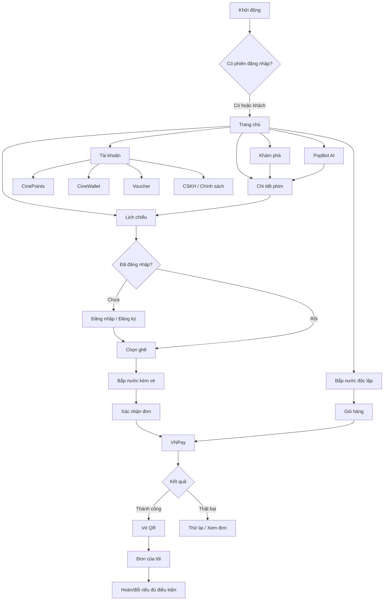
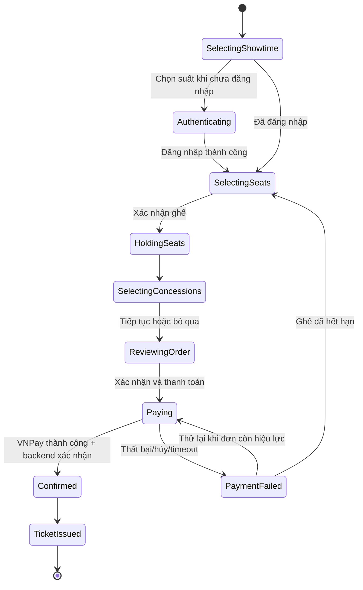
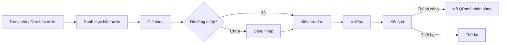
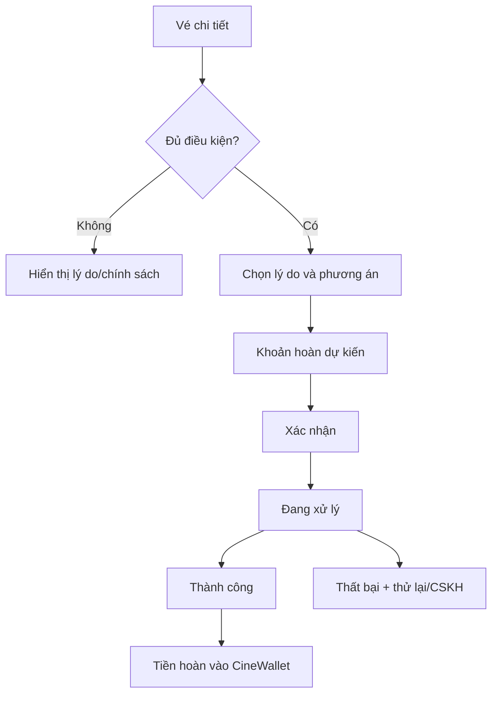
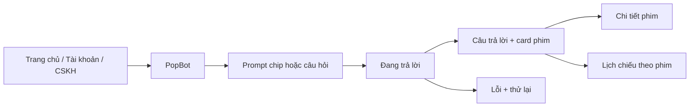

# CINEPREMIER Mobile — UI Flow Specification

> Phiên bản: 1.2  
> Phạm vi: ứng dụng Flutter dành cho khách hàng  
> Trạng thái: đặc tả luồng chức năng, dùng cùng các tài liệu kiến trúc và mapping hiện có

## 1. Mục đích

Tài liệu này là nguồn thống nhất về:

- sơ đồ màn hình và điều hướng của ứng dụng CINEPREMIER Mobile;
- hành vi của các CTA, card, menu và bottom navigation;
- dữ liệu phải được giữ xuyên suốt từng luồng;
- các trạng thái loading, empty, error và business state bắt buộc;
- tiêu chí hoàn thành để lập trình viên và tester cùng kiểm tra.

Tài liệu không mô tả chi tiết API hoặc cấu trúc database. Theo phạm vi UI hiện tại trong `MSS301_Mobile_Codex_Prompt_SOLID.md`, ứng dụng dùng mock data và chưa tích hợp backend. Các trạng thái phụ thuộc backend trong tài liệu này là yêu cầu UI cho phase tương lai, không phải chỉ dẫn tự động triển khai API.

### 1.1. Vai trò và thứ tự áp dụng nguồn tham chiếu

Các tài liệu có vai trò riêng và được áp dụng theo đúng phạm vi đã định nghĩa:

1. `MSS301_Mobile_Codex_Prompt_SOLID.md` là nguồn chuẩn về kiến trúc Flutter, coding rules, package, cấu trúc feature và phạm vi triển khai theo phase.
2. `docs/ui-reference/ai-studio/` là nguồn chuẩn về UI/design và interaction reference. Flutter phải triển khai native, không sao chép React/TypeScript.
3. `Flutter_UI_Feature_Mapping.md` là nguồn chuẩn về ánh xạ màn hình AI Studio sang Flutter feature và trạng thái triển khai hiện tại.
4. Tài liệu này chuẩn hóa luồng chức năng, navigation behavior, state và acceptance criteria mà không được ghi đè ba phạm vi trên.
5. Prompt prototype gốc và website/ảnh CINEPREMIER bổ sung yêu cầu sản phẩm và nhận diện khi reference chưa thể hiện rõ.

Code Flutter phản ánh mức triển khai thực tế. Nếu code, mapping và tài liệu khác nhau, phải cập nhật mapping hoặc làm rõ scope trước khi mở rộng implementation.

Nếu thay đổi một luồng đã được chốt, phải cập nhật tài liệu này trong cùng pull request với code.

### 1.2. Giai đoạn backend-contract-aligned mock UI

Giai đoạn hiện tại chuẩn hóa Flutter theo contract đang tồn tại trong `BE/MSS301-Backend/cinema-services`, nhưng **vẫn chạy hoàn toàn bằng mock data**. Kế hoạch triển khai chi tiết nằm tại `BACKEND_ALIGNED_MOCK_UI_PLAN.md`.

- Không gọi HTTP, không dùng token thật, không mở VNPay thật và không phụ thuộc backend đang chạy.
- DTO, enum, ID, thời gian, tiền và trạng thái trong lớp data của Flutter phải ánh xạ được với request/response Java hiện tại.
- Presentation model được phép có trường phục vụ UI, nhưng phải tách khỏi DTO backend và chuyển đổi qua mapper rõ ràng.
- Mọi repository dùng interface; implementation trong giai đoạn này là mock để sau này có thể thay bằng remote repository mà không viết lại màn hình.
- Route và tên feature đang có trong code được giữ làm alias tạm thời để tránh refactor làm nhiễu việc đánh giá UI. Việc đổi tên đồng loạt chỉ thực hiện ở một task riêng.
- Các flow chưa có public API tương ứng phải ẩn, disabled có giải thích hoặc đặt sau feature flag; không được giả định backend đã hỗ trợ.

## 2. Nguyên tắc sản phẩm bắt buộc

- Ứng dụng phục vụ một rạp duy nhất: **CineAI Central**. Không tạo luồng chọn chuỗi rạp, tỉnh hoặc thành phố.
- Người dùng khách được xem Trang chủ, Khám phá, chi tiết phim, lịch chiếu, thông tin rạp và chính sách.
- Các thao tác tạo dữ liệu cá nhân như giữ ghế, thanh toán, yêu thích, xem đơn, dùng voucher và quản lý tài khoản cần đăng nhập.
- Nếu bị yêu cầu đăng nhập giữa luồng, sau khi đăng nhập thành công phải quay lại đúng hành động và giữ nguyên context trước đó.
- Tap vào poster, tên phim hoặc vùng nội dung card mở **Chi tiết phim**.
- CTA **Đặt vé** mở **Lịch chiếu đã lọc theo phim**, không mở trang chi tiết phim.
- Tap vào một suất chiếu hợp lệ đi thẳng sang **Chọn ghế**. UI có phản hồi nhấn/loading ngắn, không cần thêm nút xác nhận suất.
- Bottom navigation chỉ xuất hiện ở năm màn hình gốc. Phải ẩn trong luồng đặt vé, thanh toán và các màn hình con tập trung.
- Trong luồng đặt vé, tổng tiền và CTA tiếp tục nằm ở thanh cố định phía dưới, không che nội dung hoặc safe area.
- Thanh toán vé và bắp nước dùng VNPay. CineWallet không phải phương thức thanh toán và không có chức năng nạp tiền.
- Chỉ phát hành vé QR hoặc mã nhận hàng sau khi backend xác nhận thanh toán thành công.
- Giá hiển thị bằng VND theo mẫu `90.000đ`; thời gian và dữ liệu phải thống nhất giữa lịch chiếu, checkout, đơn hàng và vé.
- Toàn bộ nội dung UI bằng tiếng Việt có dấu.

## 3. Kiến trúc điều hướng tổng quan

### 3.1. Năm tab chính

| Vị trí | Tab | Route đề xuất | Mục đích |
| --- | --- | --- | --- |
| 1 | Trang chủ | `/home` | Nội dung nổi bật, phim, bắp nước, PopBot và lối tắt |
| 2 | Khám phá | `/search` | Tìm kiếm, lọc, phim đang/sắp chiếu |
| 3 | Lịch chiếu | `/showtime` | Toàn bộ lịch chiếu theo ngày tại CineAI Central |
| 4 | Đơn của tôi | `/orders` | Vé xem phim và đơn bắp nước |
| 5 | Tài khoản | `/profile` | Hội viên, điểm, ví, voucher và cài đặt |

Quy tắc:

- Chuyển tab phải giữ stack độc lập hợp lý hoặc đưa người dùng về root của tab.
- Tap lại tab đang chọn đưa danh sách về đầu trang nếu đã cuộn.
- Badge ở Đơn của tôi chỉ hiển thị khi có đơn cần chú ý, không hard-code.
- Tab yêu cầu đăng nhập được phép hiển thị guest state có CTA đăng nhập thay vì tự động mở login ngay khi tap.

### 3.2. Màn hình con và route đề xuất

| Nhóm | Màn hình | Route đề xuất | Bottom nav |
| --- | --- | --- | --- |
| Phim | Chi tiết phim | `/movie/:id` | Ẩn |
| Phim | Yêu thích | `/favorites` | Ẩn |
| Phim | Trailer | Dialog/full-screen modal | Không đổi |
| Chung | Thông báo | `/notifications` | Ẩn |
| Đặt vé | Lịch chiếu theo phim | `/showtime/:movieId` | Ẩn |
| Đặt vé | Chọn ghế | `/seat-selection/:showtimeId` | Ẩn |
| Đặt vé | Chọn bắp nước | `/food?bookingId=:bookingId` | Ẩn |
| Đặt vé | Xác nhận đơn | `/checkout` | Ẩn |
| Thanh toán | Chuyển tiếp VNPay | `/payment` | Ẩn |
| Thanh toán | Kết quả thanh toán | `/payment-result` | Ẩn |
| Vé | Chi tiết vé/QR | `/ticket/:bookingId` | Ẩn |
| Vé | Hoàn/đổi vé | `/ticket/:bookingId/refund` | Ẩn |
| Bắp nước | Danh mục độc lập | `/food` | Ẩn |
| Bắp nước | Giỏ hàng | `/food/cart` | Ẩn |
| Bắp nước | Chi tiết đơn/mã nhận | `/food/order/:orderId` | Ẩn |
| Ưu đãi | Danh sách voucher | `/vouchers` | Ẩn |
| Ưu đãi | Chi tiết voucher | `/vouchers/:voucherId` | Ẩn |
| Hội viên | Quyền lợi VIP | `/membership` | Ẩn |
| Hội viên | CinePoints | `/points` | Ẩn |
| Hội viên | CineWallet | `/wallet` | Ẩn |
| Tài khoản | Hồ sơ | `/profile` | Ẩn |
| Tài khoản | Bảo mật | `/profile/security` | Ẩn |
| Hỗ trợ | Thông tin rạp | `/cinema` hoặc bottom sheet | Ẩn/không đổi |
| Hỗ trợ | Chính sách | `/policies` | Ẩn |
| Hỗ trợ | CSKH | `/help` | Ẩn |
| AI | PopBot AI | `/chatbot` | Ẩn |
| Xác thực | Đăng nhập | `/login` | Ẩn |
| Xác thực | Đăng ký | `/register` | Ẩn |
| Xác thực | OTP | `/otp` | Ẩn |
| Xác thực | Quên mật khẩu | `/forgot-password` | Ẩn |
| Xác thực | Đặt lại mật khẩu | `/reset-password` | Ẩn |

Các route trên tuân theo danh sách route chuẩn bị trong `MSS301_Mobile_Codex_Prompt_SOLID.md`. `/showtime` là root route cho tab Lịch chiếu; `/showtime/:movieId` là biến thể đã lọc theo phim. Hai entry point bắp nước cùng dùng feature `/food`; có `bookingId` thì là bước kèm vé, không có `bookingId` thì là đơn độc lập.

`payment-result`, OTP, quên/đặt lại mật khẩu, yêu thích, CinePoints và hoàn/đổi là yêu cầu flow tương lai nhưng chưa có component tương ứng đầy đủ trong AI Studio export. Khi triển khai, phải dùng design system hiện có và cập nhật `Flutter_UI_Feature_Mapping.md`; không được ghi nhận là đã có visual reference hoàn chỉnh.

### 3.3. Ánh xạ Flutter feature

Tên feature kỹ thuật tuân theo `Flutter_UI_Feature_Mapping.md`:

| UI | Flutter feature |
| --- | --- |
| Trang chủ | `features/home` |
| Khám phá/tìm kiếm | `features/search` |
| Chi tiết phim | `features/movie` |
| Lịch chiếu | `features/showtime` |
| Chọn ghế | `features/seat` |
| Bắp nước | `features/food` |
| Checkout | `features/checkout` |
| Thanh toán | `features/payment` |
| Đơn của tôi | `features/booking` |
| Vé QR | `features/ticket` |
| Tài khoản | `features/profile` |
| Voucher | `features/promotion` |
| PopBot AI | `features/chatbot` |
| CSKH | `features/support` |

Không tạo song song các feature đồng nghĩa như `discover/search`, `orders/booking`, `account/profile` hoặc `popbot/chatbot`.

Trong giai đoạn backend-contract-aligned mock UI, code hiện tại được phép giữ các alias sau để tránh thay đổi lớn không liên quan. Không tạo thêm alias mới:

| Chuẩn tài liệu | Code hiện tại | Xử lý trong giai đoạn này |
| --- | --- | --- |
| `/search`, `features/search` | `/discover`, `features/discover` | Giữ nguyên, ghi nhận migration riêng |
| `/showtime`, `features/showtime` | `/showtimes`, `features/showtime` | Giữ route hiện tại; không tạo route trùng |
| `/profile`, `features/profile` | `/account`, `features/account` | Giữ nguyên, repository mock ánh xạ profile/wallet/loyalty riêng |
| `features/booking` | `features/orders` | Giữ presentation hiện tại; model dùng contract booking |

Route chuẩn trong bảng 3.1–3.2 vẫn là đích dài hạn. Alias chỉ phản ánh implementation hiện tại, không thay đổi tên nghiệp vụ đã chốt.

### 3.4. App shell

- Màn hình root dùng header thương hiệu và bottom navigation.
- Màn hình con dùng app bar có Back, title ngắn và action cần thiết.
- Màn hình auth dùng layout auth riêng, không hiển thị shell chính.
- Màn chọn ghế, checkout và thanh toán phải dành tối đa diện tích cho tác vụ, không hiển thị bottom navigation.
- Back trong booking không được tự động xóa lựa chọn. Nếu việc quay lại sẽ giải phóng ghế hoặc hủy phiên, phải hỏi xác nhận.

### 3.5. Hành động toàn cục

- Tìm kiếm mở tab Khám phá và focus ô tìm kiếm.
- Biểu tượng trái tim mở Yêu thích; nếu chưa đăng nhập thì dùng auth gate và resume.
- Thông báo mở Notification Center; badge lấy từ số thông báo chưa đọc, không hard-code.
- Avatar mở tab Tài khoản hoặc màn hình hồ sơ tùy vị trí sử dụng.
- Tap tên CineAI Central mở thông tin rạp dạng bottom sheet; CTA trong sheet mở Lịch chiếu.

## 4. Bản đồ luồng toàn hệ thống



## 5. Luồng A — Khám phá và xem phim

### 5.1. Trang chủ → Chi tiết phim

1. Người dùng mở Trang chủ.
2. Hero carousel hiển thị banner ngang, title, metadata, CTA **Đặt vé** và **Xem trailer**.
3. Tap banner/title/card → Chi tiết phim.
4. Tap **Đặt vé** → Lịch chiếu theo phim.
5. Tap **Xem trailer** → modal trailer; đóng modal trở lại đúng vị trí cuộn.

Trang chủ phải có:

- phim nổi bật;
- phim đang chiếu;
- phim sắp chiếu;
- gợi ý cá nhân kèm lý do;
- lối tắt Bắp & Nước, PopBot AI, Ưu đãi VIP và CinePoints;
- thể loại thịnh hành;
- loading skeleton, lỗi tải và retry.

Không được dùng cùng một callback cho tap card và CTA Đặt vé.

### 5.2. Khám phá → Tìm kiếm/lọc → Chi tiết phim

1. Mở tab Khám phá.
2. Chọn tab **Đang chiếu** hoặc **Sắp chiếu**.
3. Nhập từ khóa; tìm theo tên phim, thể loại và nội dung liên quan.
4. Mở filter bottom sheet để chọn thể loại, ngày hoặc định dạng.
5. Chọn card phim → Chi tiết phim.
6. Chọn CTA trên card → Lịch chiếu theo phim nếu đã mở bán.

Trạng thái bắt buộc:

- đang nhập và có kết quả;
- không có kết quả, có nút xóa bộ lọc;
- đang tải;
- lỗi mạng và retry;
- phim sắp chiếu với trạng thái **Chưa mở bán**.

### 5.3. Chi tiết phim

Nội dung tối thiểu:

- backdrop, poster, tên, phân loại tuổi, thời lượng, thể loại và ngôn ngữ;
- trailer và yêu thích;
- nội dung phim có Xem thêm/Thu gọn;
- đạo diễn, diễn viên;
- ngày khởi chiếu;
- đánh giá và nhận xét;
- CTA cố định dưới.

Quy tắc CTA:

- phim đang chiếu/có suất mở bán → **Đặt vé**;
- phim sắp chiếu/chưa có suất → CTA disabled **Chưa mở bán**, có thể có **Nhắc tôi**;
- chỉ người đã có vé `USED/COMPLETED` của phim mới được viết đánh giá;
- yêu thích yêu cầu đăng nhập và phải resume đúng trang sau login.

## 6. Luồng B — Đặt vé hoàn chỉnh



### 6.1. Chọn lịch chiếu

Entry point:

- CTA Đặt vé từ Home/Discover/Movie Detail/PopBot;
- tab Lịch chiếu;
- Đặt lại vé từ lịch sử đơn;
- Sử dụng voucher từ danh sách voucher.

Hành vi:

1. Nếu vào từ một phim, chỉ hiển thị hoặc ưu tiên đúng phim đó.
2. Nếu vào từ tab Lịch chiếu, hiển thị danh sách toàn bộ phim theo ngày.
3. Ngày được tạo theo thời gian thực; không hard-code ngày demo vào production.
4. Suất đã qua giờ bắt đầu hoặc hết chỗ phải disabled và có nhãn rõ.
5. Tap suất hợp lệ:
   - ghi nhận `movieId`, `showtimeId`, ngày, giờ, phòng, định dạng và giá;
   - nếu chưa đăng nhập, mở auth và lưu pending action;
   - nếu đã đăng nhập, đi thẳng sang Chọn ghế.

### 6.2. Chọn ghế

UI bắt buộc:

- tóm tắt phim, ngày giờ, phòng và định dạng;
- đồng hồ đếm ngược giữ ghế;
- màn chiếu và sơ đồ ghế có mã hàng/cột;
- ghế thường, VIP và ghế đôi;
- trạng thái hiển thị available, selected local, held runtime, booked/sold và maintenance;
- chú giải bằng màu kết hợp chữ/icon;
- zoom/pan khi sơ đồ vượt khung;
- loại vé và cảnh báo độ tuổi;
- thanh dưới có danh sách ghế, tổng tiền và CTA **Tiếp tục**.

Quy tắc:

- không cho chọn ghế sold/held;
- giới hạn số ghế theo rule backend; prototype dùng tối đa 6 ghế;
- ghế đôi phải chọn/bỏ theo cặp nếu business rule yêu cầu;
- trước khi người dùng xác nhận ghế, lựa chọn chỉ là state local và chưa có đồng hồ giữ ghế;
- đồng hồ 3 phút chỉ bắt đầu sau khi mock repository trả booking `HOLDING`, bám theo thời hạn giữ ghế hiện tại của booking service;
- `SeatStatus` backend (`AVAILABLE`, `UNAVAILABLE`, `MAINTENANCE`) mô tả trạng thái vật lý; held/booked lấy từ runtime status, còn selected chỉ tồn tại trong UI;
- khi backend trả conflict, cập nhật ghế thành không khả dụng và thông báo cụ thể;
- hết thời gian giữ ghế → modal thông báo, giải phóng session và đưa về lịch chiếu hoặc chọn lại;
- back khi đang giữ ghế → hỏi xác nhận trước khi giải phóng.

### 6.3. Chọn bắp nước kèm vé

1. Hiển thị combo và món lẻ theo danh mục.
2. Người dùng tăng/giảm số lượng.
3. Tạm tính cập nhật tức thời.
4. Có CTA **Bỏ qua** và **Tiếp tục**.
5. Trở lại từ checkout phải khôi phục giỏ trước đó.

Trạng thái bắt buộc: loading, empty menu, hết món, lỗi tải ảnh, số lượng tối đa và lỗi cập nhật giá.

### 6.4. Xác nhận đơn

Phải hiển thị snapshot bất biến của:

- phim, rạp, phòng, ngày giờ;
- ghế và loại vé;
- bắp nước;
- tạm tính, voucher/CinePoints nếu chính sách cho phép, giảm giá và tổng thanh toán;
- phương thức VNPay;
- thời gian giữ ghế còn lại.

Người dùng được quay lại sửa ghế hoặc bắp nước khi phiên giữ ghế còn hiệu lực. CTA thanh toán phải chống double tap và thể hiện loading.

### 6.5. VNPay và kết quả thanh toán

Các trạng thái riêng biệt:

- `redirecting`: đang chuyển sang VNPay;
- `processing`: đã quay lại app, đang xác minh;
- `success`: backend xác nhận thanh toán;
- `failed`: bị từ chối/lỗi;
- `cancelled`: người dùng hủy ở cổng thanh toán;
- `unknown`: chưa xác định, cho phép kiểm tra lại;
- `expired`: thời gian giữ ghế đã hết.

Chỉ `success` được mở Vé QR. Không suy ra thành công chỉ từ query/deep link phía client.

Trong mock, trạng thái payment và booking phải tách riêng: payment có thể đã `SUCCESS` trong một khoảng mô phỏng ngắn trong khi booking vẫn `PENDING_PAYMENT`; chỉ khi booking chuyển sang `PAID` mới phát hành QR. Contract hiện tại có thời hạn giữ ghế 3 phút nhưng URL VNPay 15 phút, nên tích hợp thật phải chờ backend thống nhất quy tắc xử lý payment đến sau khi booking đã hết hạn.

### 6.6. Vé QR

- QR màu đen trên nền trắng, có quiet zone rõ.
- Hiển thị tên phim, rạp, phòng, ngày giờ, ghế, mã booking/ticket.
- Dùng booking QR làm mã chính theo `BookingResponse`; QR theo từng ghế/vé chỉ hiển thị khi contract trả dữ liệu tương ứng.
- Trạng thái: Đã thanh toán, Đã sử dụng, Hết hạn, Đã hủy/hoàn.
- Có hướng dẫn đưa QR tại cổng soát vé.
- Chỉ hiện Hoàn/Đổi khi đủ điều kiện.

## 7. Luồng C — Bắp nước độc lập



Quy tắc:

- đơn bắp nước độc lập không được gắn giả vào booking vé;
- có mã đơn riêng, thời gian đặt và trạng thái chuẩn bị/đã nhận/đã hủy;
- có thể xem lại trong tab **Bắp nước** của Đơn của tôi;
- chỉ sinh mã nhận hàng sau khi thanh toán thành công;
- backend hiện mới có entity `FoodOrder`, chưa có public customer API hoàn chỉnh; toàn bộ flow độc lập là UI preview sau feature flag và không được xem là contract sẵn sàng tích hợp;
- giỏ hàng giữ nguyên khi login hoặc quay lại từ màn kiểm tra đơn.

## 8. Luồng D — Đăng nhập, đăng ký và khôi phục tài khoản

### 8.1. Auth gate và pending action

Khi gặp thao tác cần đăng nhập, lưu:

- route nguồn;
- action cần tiếp tục;
- các ID liên quan như movie/showtime/voucher;
- booking draft không nhạy cảm.

Sau login:

- tiếp tục pending action nếu còn hợp lệ;
- nếu dữ liệu đã hết hạn, thông báo và đưa về màn gần nhất an toàn;
- không mặc định đẩy mọi trường hợp sang trang Tài khoản.

### 8.2. Đăng nhập

- email, mật khẩu, hiện/ẩn mật khẩu;
- Google sign-in;
- Quên mật khẩu, Đăng ký;
- tiếp tục xem phim với tư cách khách;
- loading, lỗi form, sai thông tin, tài khoản khóa và lỗi mạng.

### 8.3. Đăng ký → OTP

1. Nhập thông tin tài khoản và mật khẩu.
2. Đồng ý điều khoản; liên kết chính sách phải mở được.
3. Gửi form → OTP.
4. OTP có đếm ngược, gửi lại, đổi email, mã sai và mã hết hạn.
5. Thành công → tài khoản hoặc pending action.

### 8.4. Quên mật khẩu

`Nhập email → OTP → Mật khẩu mới → Thành công → Đăng nhập/pending action`.

Có biến thể thiết lập mật khẩu cho tài khoản Google khi backend yêu cầu.

## 9. Luồng E — Đơn hàng, vé và hoàn/đổi

### 9.1. Đơn của tôi

- Tab **Vé xem phim** và **Bắp nước**.
- Bộ lọc: tất cả, chờ thanh toán, sắp chiếu/đang chuẩn bị, hoàn tất, đã hủy/hoàn.
- Tap card vé → Chi tiết vé.
- Tap card bắp nước → Chi tiết đơn và mã nhận hàng.
- Đặt lại vé → lịch chiếu của phim nếu vẫn còn mở bán.
- Empty state có CTA khám phá hoặc mua bắp nước.

### 9.2. Hoàn/đổi vé



Quy tắc:

- eligibility, deadline và số tiền hoàn phải đến từ backend;
- không đổi trạng thái vé chỉ bằng state local;
- thao tác cần xác nhận hai bước;
- khi thành công, cập nhật vé, đơn và giao dịch CineWallet;
- nếu “Đổi vé” không được backend hỗ trợ như một giao dịch riêng, UI diễn giải thành hoàn vé rồi đặt suất mới, không giả lập đổi trực tiếp.
- backend hiện chỉ có trường/trạng thái refund trên entity/response, chưa có public API gửi yêu cầu hoàn/đổi; màn hình này chỉ được chạy bằng mock sau feature flag cho đến khi contract được chốt.

## 10. Luồng F — Tài khoản và hội viên

### 10.1. Tài khoản

Guest state:

- mô tả lợi ích;
- CTA Đăng nhập/Đăng ký;
- vẫn mở được Thông tin rạp, Chính sách và CSKH.

Logged-in state:

- avatar, họ tên, email;
- thẻ CinePremier VIP Club và QR hội viên;
- số dư CinePoints;
- số dư CineWallet;
- Vé của tôi, Yêu thích, Voucher, PopBot, Hồ sơ, Bảo mật, Thông tin rạp, Chính sách, CSKH;
- Đăng xuất có xác nhận.

### 10.2. CinePoints

- số dư hiện tại;
- lịch sử cộng/trừ, nguồn giao dịch và thời gian;
- giải thích quy tắc tích/đổi điểm;
- loading, empty và error.

Nếu checkout cho phép dùng điểm, số điểm tối đa và discount phải lấy từ quote backend, không tự tính riêng trong UI. Do booking service và loyalty service hiện chưa thống nhất cơ chế kiểm tra/trừ điểm, tính năng dùng điểm tại checkout mặc định tắt trong mock release; màn CinePoints và lịch sử điểm vẫn có thể dựng bằng repository mock.

### 10.3. CineWallet

- số dư;
- lịch sử hoàn tiền/rút tiền/giao dịch;
- yêu cầu rút tiền và trạng thái xử lý nếu backend hỗ trợ;
- không có Nạp tiền;
- không hiển thị CineWallet như phương thức thanh toán vé.

### 10.4. Voucher và VIP

- danh sách voucher theo Available/Used/Expired;
- chi tiết điều kiện, thời hạn, phạm vi và cách dùng;
- CTA dùng voucher mở lịch chiếu/checkout phù hợp và giữ voucher pending;
- không cho áp dụng voucher hết hạn hoặc không hợp lệ;
- trang VIP mô tả hạng, quyền lợi và điều kiện, không hard-code quyền hoàn vé nếu backend/policy không xác nhận.

### 10.5. Hồ sơ và bảo mật

- chỉnh sửa họ tên, số điện thoại, avatar;
- validate và thông báo lưu thành công/thất bại;
- đổi mật khẩu;
- thiết lập mật khẩu cho tài khoản social nếu cần;
- không hiển thị dữ liệu nhạy cảm trong log/toast.

## 11. Luồng G — Yêu thích và đánh giá

### 11.1. Yêu thích

1. Tap trái tim ở card hoặc chi tiết phim.
2. Nếu chưa đăng nhập → login và resume thao tác.
3. Nếu đã đăng nhập → optimistic state có rollback khi lỗi.
4. Trang Yêu thích cho phép bỏ lưu, xem chi tiết và đặt vé.
5. Empty state có CTA Khám phá.

### 11.2. Đánh giá phim

- chỉ mở form khi người dùng có vé đã sử dụng/hoàn tất của phim;
- hiển thị verified ticket;
- rating, nội dung, validation và trạng thái gửi;
- người chưa đủ điều kiện chỉ đọc đánh giá.

### 11.3. Thông báo

- Nhóm thông báo đặt vé, thanh toán, nhắc lịch, voucher và hệ thống.
- Tap thông báo phải deep-link đến đúng vé, đơn, phim hoặc voucher.
- Trạng thái đã đọc/chưa đọc, đánh dấu tất cả đã đọc, loading, empty và error.
- Không để badge thông báo tồn tại khi danh sách không có item chưa đọc.

## 12. Luồng H — PopBot AI



UI cần có:

- tin nhắn chào và chip gợi ý;
- bubble user/bot rõ ràng;
- trạng thái đang trả lời, lỗi và retry;
- card phim có lý do gợi ý;
- CTA Xem chi tiết và Đặt vé;
- input không bị keyboard che;
- disclaimer phù hợp khi AI trả lời về chính sách hoặc giao dịch.

PopBot không tự xác nhận đặt vé, hoàn tiền hoặc thanh toán; các hành động này phải chuyển sang flow chính thức.

## 13. Luồng I — Thông tin rạp, chính sách và CSKH

### 13.1. Thông tin rạp

- CineAI Central, địa chỉ, hotline, giờ hoạt động;
- tiện ích và thông tin phòng A/B/C;
- mở bản đồ qua external intent;
- CTA Xem lịch chiếu;
- không có UI đổi chi nhánh.

### 13.2. Chính sách

- nhóm mục accordion: đặt vé, thanh toán, hoàn/đổi, độ tuổi, bắp nước, quyền riêng tư;
- mỗi mục có phiên bản/ngày hiệu lực khi backend cung cấp;
- link chính sách từ đăng ký, checkout, vé và help phải đến đúng mục.

### 13.3. CSKH

- tìm kiếm FAQ;
- danh mục câu hỏi;
- hotline, email, giờ hỗ trợ;
- trạng thái không tìm thấy;
- chuyển sang PopBot để tư vấn chung;
- khi hỏi về giao dịch, cung cấp lối vào đúng đơn thay vì để AI tự xử lý.

## 14. Trạng thái UI dùng chung

Mỗi màn hình phụ thuộc dữ liệu phải thiết kế tối thiểu các trạng thái sau:

| Trạng thái | Hành vi UI |
| --- | --- |
| Initial/loading | Skeleton theo đúng cấu trúc nội dung, không chỉ spinner toàn trang |
| Refreshing | Giữ nội dung cũ khi có thể và hiển thị progress nhẹ |
| Success | Hiển thị dữ liệu và CTA đúng quyền |
| Empty | Giải thích ngắn, icon phù hợp và CTA khôi phục |
| Offline/network error | Thông báo rõ và nút Thử lại |
| Validation error | Lỗi gần field/action, không chỉ toast chung |
| Business error | Giải thích tình huống như ghế vừa bị giữ hoặc voucher không hợp lệ |
| Unauthorized | Auth gate có pending action |
| Forbidden | Giải thích thiếu quyền/không đủ điều kiện |
| Not found | CTA về màn an toàn gần nhất |
| Submitting | Khóa double tap, giữ nội dung và thể hiện tiến trình |
| Success feedback | Snackbar/banner hoặc màn thành công tùy mức độ hành động |

Quy tắc lỗi:

- toast/snackbar chỉ dùng cho phản hồi ngắn;
- lỗi chặn luồng cần inline state, dialog hoặc full-page state;
- không dùng thông báo “sẽ có trong giai đoạn tiếp theo” cho control đã xuất hiện trong bản release;
- chức năng chưa sẵn sàng phải được ẩn, disabled có giải thích, hoặc đặt sau feature flag.

## 15. Dữ liệu xuyên suốt và nguồn sự thật

### 15.1. Booking draft

Booking state tối thiểu:

```text
cinemaId
movieId
showtimeId
showDateTime
roomId / roomName
format
selectedSeats[]
bookingId
holdExpiresAt
concessions[]
voucherId / voucherCode (provisional)
pointsApplied
subtotal
discountAmount
total
paymentId
bookingStatus
paymentStatus
```

Không truyền cả object lớn chỉ qua constructor nếu route có thể được mở lại/deep link. Route chứa ID; provider/repository là nguồn state.

### 15.2. Tính nhất quán demo

Khi dùng mock data, dùng cùng một kịch bản chuẩn:

- rạp CineAI Central;
- phim Inception;
- suất 20:30, Phòng C;
- ghế C4, C5;
- giá vé 90.000đ/người;
- combo 89.000đ;
- tổng trước ưu đãi 269.000đ.

Không để ngày được gắn nhãn “Hôm nay” nhưng đã nằm trong quá khứ. Mock date phải sinh tương đối theo thời gian chạy hoặc được clock provider kiểm soát trong test.

### 15.3. Trạng thái contract và state local

State chỉ tồn tại trong UI trước khi tạo booking:

```text
BROWSING → SELECTING_SHOWTIME → SELECTING_SEATS
```

Booking status bám đúng enum backend:

```text
HOLDING → PENDING_PAYMENT → PAID → USED
   │              │          └──→ REFUNDED
   ├──────────────┴──────────────→ CANCELLED
   └──────────────┴──────────────→ EXPIRED
```

Payment status là state machine riêng:

```text
PENDING → SUCCESS / FAILED
SUCCESS → REFUNDED
```

Booking seat status dùng `HOLDING`, `BOOKED`, `CHECKED_IN`, `RELEASED`. Food order hiện dùng chuỗi trạng thái trong backend và chưa có enum/API công khai hoàn chỉnh, nên mock phải cô lập mapper tạm thời thay vì coi các giá trị UI là contract chính thức.

Tên hiển thị tiếng Việt có thể khác enum nhưng mapping phải nằm ở một nơi dùng chung. Mọi enum đọc từ fixture cần có fallback `unknown` ở phía Flutter để không làm crash UI khi backend bổ sung giá trị.

## 16. Quy chuẩn thiết kế dùng chung

### 16.1. Visual foundation

- frame tham chiếu: `390 × 844px`;
- hỗ trợ tối thiểu width 360, 390 và 412;
- background `#0E0E0F`;
- surface `#171719`, raised surface `#202024`, border `#2B2B30`;
- gold accent `#F5B800`;
- purple `#6F00BE` và lavender `#DDB7FF` dành cho AI, phim sắp chiếu và bắp nước;
- text chính `#FFFFFF`, text phụ `#D4D4D8`, text muted `#A1A1AA`;
- font Inter có tiếng Việt;
- poster `2:3`; hero dùng banner ngang chuyên dụng, không dùng poster dọc crop thay thế trong bản hoàn thiện;
- spacing theo scale `4/8/12/16/20/24/32` và lấy từ theme, không rải magic number;
- vùng chạm tối thiểu `44 × 44px`; CTA chính khoảng 52px;
- radius dùng các token `8/12/16px`; bottom sheet có thể dùng góc trên 24px khi reference yêu cầu;
- header và bottom navigation cao 64px theo mapping hiện tại;
- dùng Material Icons gần nhất với Material Symbols trong reference, chưa thêm icon dependency chỉ để khớp hình;
- không biểu đạt trạng thái chỉ bằng màu.

### 16.2. Shared components tối thiểu

- primary/secondary/destructive button;
- icon button và back button;
- text/password/search field;
- movie card và movie hero;
- age/status/format badge;
- filter chip và segmented tabs;
- showtime chip;
- seat và seat legend;
- order card;
- ticket/QR card;
- amount summary;
- sticky bottom action bar;
- modal/bottom sheet/confirmation dialog;
- skeleton, empty, error và retry state.

Shared component chỉ chứa quy tắc trình bày/tương tác chung; business logic ở feature state/notifier.

## 17. Ma trận màn hình và tiêu chí hoàn thành

| Màn hình | CTA/đích chính | Trạng thái đặc biệt bắt buộc |
| --- | --- | --- |
| Trang chủ | Detail, Showtimes, Food, PopBot | Hero responsive, loading/error |
| Khám phá | Detail, Showtimes | Search empty, filter, coming soon |
| Chi tiết phim | Trailer, Favorite, Showtimes | Chưa mở bán, review eligibility |
| Lịch chiếu | Seat selection | Sold out, past slot, no schedule |
| Chọn ghế | Concessions | Conflict, hold timeout, seat types |
| Bắp nước kèm vé | Review order | Empty/out of stock, skip |
| Xác nhận đơn | VNPay | Quote changed, hold expiry |
| Kết quả thanh toán | Ticket/Retry/Orders | Processing/success/failure/unknown |
| Vé QR | Refund/Orders/Home | Paid/used/expired/refunded |
| Bắp nước độc lập | Cart | Categories, empty/error |
| Giỏ bắp nước | VNPay | Empty cart, price changed |
| Chi tiết đơn bắp nước | Pickup QR | Preparing/ready/collected |
| Đơn của tôi | Ticket/Food detail | Tabs, filters, empty |
| Hoàn/đổi | Submit request | Eligible/ineligible/processing/result |
| Đăng nhập | Resume pending action | Invalid/offline/locked |
| Đăng ký | OTP | Validation/terms/duplicate email |
| OTP | Next/resend/change email | Countdown/wrong/expired |
| Quên/reset mật khẩu | Login/resume | Invalid/expired/success |
| Yêu thích | Detail/Showtimes | Guest/empty/error |
| Thông báo | Deep-link theo nội dung | Unread/read/empty/error |
| Tài khoản | Profile/features | Guest/logged-in |
| Hồ sơ | Save | Validation/saving/success/error |
| Bảo mật | Change password | Social account variant |
| CinePoints | History | Empty/loading/error |
| CineWallet | Withdraw/history | Pending/refund/withdraw status |
| Voucher | Detail/use | Available/used/expired/ineligible |
| VIP | Related benefit | Tier/conditions/loading |
| PopBot | Detail/Showtimes | Thinking/error/retry |
| Thông tin rạp | Map/Showtimes | External app unavailable |
| Chính sách | Expand section | Loading/version/error |
| CSKH | FAQ/contact/PopBot | Search empty/offline |

Các màn Bắp nước độc lập, Hoàn/đổi, Voucher, VIP, Yêu thích, Đánh giá, Thông báo và PopBot là mục tiêu UI sản phẩm nhưng chưa có public API đầy đủ trong backend hiện tại. Khi dựng mock, phải gắn feature flag hoặc nhãn preview nội bộ; không đưa control dạng active vào release nếu chỉ dẫn đến snackbar.

Một màn hình chỉ được xem là hoàn thành khi:

1. Có route và back behavior đúng.
2. Tất cả CTA hiển thị đều hoạt động hoặc có disabled state hợp lệ.
3. Có loading, empty/error phù hợp với dữ liệu của màn hình.
4. Không overflow ở width 360/390/412 và text scale phổ biến.
5. Không mất state ngoài ý muốn khi back hoặc auth resume.
6. Có widget/navigation test cho happy path và critical error state.

## 18. Thứ tự triển khai theo tài liệu SOLID

Thứ tự dưới đây tuân theo `MSS301_Mobile_Codex_Prompt_SOLID.md`. Trạng thái đã làm/chưa làm của từng màn hình được quản lý tại `Flutter_UI_Feature_Mapping.md`, không được suy ra từ roadmap này.

### Phase 1 — Foundation

1. Feature-first structure.
2. Theme, typography, spacing và radius tokens.
3. GoRouter, Riverpod và app shell.
4. Shared widgets cần thiết.
5. Bottom navigation và responsive foundation.

### Phase 2 — Home

1. Trang chủ theo AI Studio reference.
2. Mock movie/cinema data có cấu trúc.
3. Hero, movie cards, genre, PopBot banner và quick actions.
4. Movie Detail placeholder route.
5. Widget/navigation test cho Home ở width 360/390/412.

### Phase 3 — Core booking flow

1. Movie Detail hoàn chỉnh.
2. Lịch chiếu → Chọn ghế → Bắp nước.
3. Checkout → Payment mock states.
4. Booking Success → Vé QR.
5. Conflict ghế, timeout, payment failure và resume flow ở mức UI/mock tương ứng với phase.

### Phase 4 — Supporting flows

1. Đơn của tôi và hoàn/đổi vé.
2. Bắp nước độc lập và mã nhận hàng.
3. Voucher, CinePoints, CineWallet và VIP.
4. Auth, hồ sơ, bảo mật và yêu thích.
5. PopBot AI, thông tin rạp, chính sách, CSKH, đánh giá và notification center.

Phạm vi mặc định trong tài liệu SOLID vẫn chỉ cho phép Phase 1 và Phase 2. Yêu cầu hiện tại mở rộng riêng phần **chuẩn hóa contract và repository mock** cho các flow cần đánh giá UI, nhưng không cho phép tích hợp API thật hoặc coi Phase 3/4 là đã hoàn thành. Thứ tự chi tiết và điều kiện hoàn thành áp dụng theo `BACKEND_ALIGNED_MOCK_UI_PLAN.md`.

## 19. Checklist test end-to-end tối thiểu

- Home → Đặt vé → chọn suất → login → ghế → bỏ qua bắp nước → VNPay → vé QR.
- Movie detail → trailer → favorite → login → quay lại movie detail.
- Lịch chiếu tab → suất hết chỗ/past slot không thể chọn → suất hợp lệ vào ghế.
- Hai client chọn cùng ghế → client sau nhận conflict và UI cập nhật.
- Giữ ghế hết hạn tại checkout → không thể thanh toán vé cũ.
- VNPay success nhưng app chưa xác minh → giữ trạng thái processing, chưa sinh QR.
- Payment failure → retry; nếu hold hết hạn thì quay về chọn ghế.
- Đơn của tôi → Vé → Hoàn/đổi đủ điều kiện → CineWallet có giao dịch hoàn.
- Bắp nước độc lập → thanh toán → mã nhận hàng → trạng thái đã nhận.
- Voucher hết hạn/không đủ điều kiện không thể áp dụng.
- Guest mở Tài khoản/Đơn → login → trở lại đúng màn hình.
- PopBot → card phim → chi tiết → đặt vé đúng movie ID.
- Offline/loading/empty/error trên các danh sách chính.
- Layout không overflow ở 360/390/412px và khi bàn phím mở.

## 20. Các điều không được tự ý thêm

- nhiều rạp hoặc chọn tỉnh/thành phố;
- nạp tiền CineWallet;
- dùng CineWallet làm phương thức thanh toán vé;
- phát hành QR trước khi thanh toán được xác nhận;
- tự tính eligibility hoàn tiền ở client;
- tự động chọn sẵn suất hoặc ghế khi người dùng chưa thao tác;
- route dẫn vào snackbar “sẽ có sau” đối với tính năng đang hiển thị như có thể sử dụng;
- sao chép nguyên React/TypeScript reference vào Flutter;
- hard-code ngày “Hôm nay”, badge count, số dư hoặc trạng thái đơn trong UI production.

---

Khi bổ sung màn hình mới, cần cập nhật tối thiểu các phần: route catalog, flow liên quan, screen completion matrix và E2E checklist trong tài liệu này.
